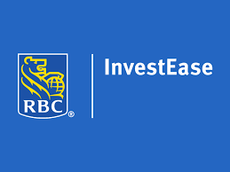
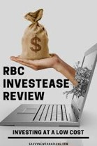
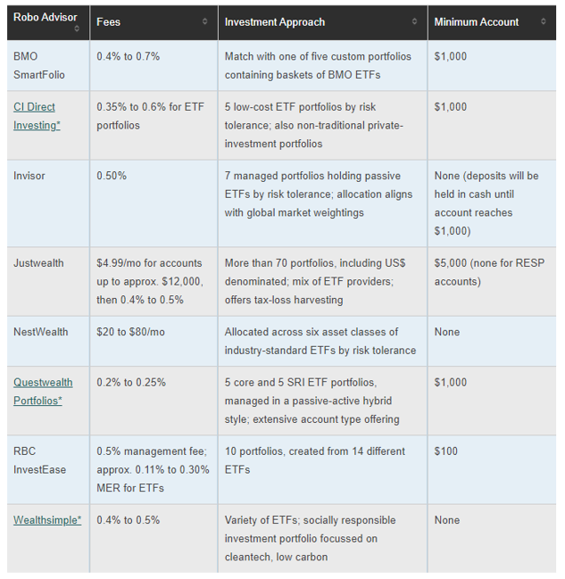

# “The Robo’s have invaded”

## Overview and Origin:
*The term Robo refers to the Companies have caught on, and they’re starting to provide innovative new ways through automated digital platforms  to invest your savings without all the traditional red tape and higher minimum amounts and fees using algorithm-driven financial planning services with little to no human supervision.*      

 **When was the company Incorporated:** 
 *RBC InvestEase was launched Nov 2018, it comes a year after the bank began testing the platform through a small pilot project involving employees in Ontario. In January 2019, the bank launched a pilot project for a select group of clients in the same province.*    

**Who are the founders of the company?**    
*RBC InvestEase Inc. is a wholly-owned subsidiary of Royal Bank of Canada and uses the business name RBC InvestEase.*

**How did the idea for the company (or project) come about?**
*RBC says it developed the platform in response to the growing segment of clients who want access to investment advice from accredited advisors but also want to do it all online, with minimal effort and with low fees. Canadians told RBC “ They are looking for a new way to invest that fits into their busy lifestyles. They want a convenient automated advice solution that is available whenever they are ready to get started.” “They also told RBC they want to be hands-off, with experts making decisions for them, and easy access to an expert, if needed.”*

**How is the company funded? How much funding have they received?**
*There’s no question that having the backing of RBC carries a lot of weight. RBC Direct Investing provides custodial services for the money you invest with RBC InvestEase. That means RBC Direct Investing Inc. is responsible for keeping your financial assets safe, maintaining your accounts, record keeping, trade settlement and reporting. ***Royal Bank being one of the largest bank was self funded and created this as a value added product to be a credible leader in the finance space*** The amount of funding is not clear as InvestEase has used available resources and have collaborated their technology with RBC for better customer experience.*

## Business Activities:

**What specific financial problem is the company or project trying to solve?**
*RBC came out with a digital investment advice service called RBC InvestEase, which delivers investment advice, personalized recommendations and portfolio management—all totally automated online and at a cost that’s much lower than most options*

*There are other ways to invest online, of course. For example, with discount brokerages, you put money into an account and then you have to divvy up those funds among securities on your own. Robo advisors, on the other hand, automatically split up the assets in your robo account (again, it could be an RRSP, RESP, TFSA or others) into various ETFs based on your risk tolerance and goals.*

*Their main focus is to be a One Stop Shop Solution for investing and financial needs, Trustworthiness of the product, Technologically advanced approach , Ease of use, Backed by Human Advisors when needed.* 

**Who is the company's intended customer?  Is there any information about the market size of this set of customers?**
*Existing RBC clients will have no trouble navigating the RBC InvestEase platform. It can be accessed and viewed from RBC Online Banking and is accessible through the RBC Mobile App.RBC InvestEase fits perfectly in-between RBC’s full-service line up of mutual funds, and its self-directed RBC Direct Investing platform for do-it-yourself investors. RBC clients to save on fees and grow their portfolios, but it also rivals the best robo-advisors in Canada. In fact, their annual fees match those charged by Canada’s leading robo-advisor offering companies. The estimated to be managed. RBC’s marketshare is in the robo-advisory market is not clearly defined. Robo-Advisory market services in 2020 instituted between $ 2.2 trillion and $ 3.7 trillion in assets*

**What solution does this company offer that their competitors do not or cannot offer? (What is the unfair advantage they utilize?)**
*Unlike other robo advisors, RBC InvestEase does not offer tiered pricing discounts based on higher assets under management. From our research, RBC has the simplest, most transparent, easiest-to-understand fee structure with a flat 0.5% fee based on your account’s average Assets Under Management. Note that RBC sometimes has limited time promotions waiving the 0.5% management fee for a period of time.*

*The terms of fees, at 0.50% plus a very reasonable 0.11% – 0.22% MER (Management Expense Ratio), RBC InvestEase is right on par with Wealthsimple for investors with less than $100,000 to invest. The difference is that RBC InvestEase does not offer price breaks for investors with larger accounts – it’s a flat 0.50% management fee for every client.
The passive exchange-traded funds (ETFs) from RBC iShares investing ETFs are screened to exclude companies involved in tobacco, controversial weapons, and civilian firearms. Socially conscious critics may argue, however, that the Extended ESG Focus methodology used by RBC iShares is less rigid than it could be. Backed by the Bank, RBC InvestEase is a clear winner for investors who want to save on fees but also want to keep their portfolio with a big bank which has been around for more than 150 years creating security and reliability.*    

**Which technologies are they currently using, and how are they implementing them? (This may take a little bit of sleuthing–– you may want to search the company’s engineering blog or use sites like Stackshare to find this information.)**
*For example,  Backed by the clout and security of a big bank, RBC InvestEase InvestEase is fully integrated into the RBC Mobile app and RBC Online Banking so one can see all your accounts in one place – no need for another app on your phone. It also benefits from instant transfers from your bank account to your investment account.*

*Their portfolios are built using Blackrock iShares ETFs. When RBC InvestEase was initially launched it offered ETFs exclusively provided by RBC Global Asset Management. In early 2019, RBC and iShares entered into  a strategic alliance with more than 150 ETFs and approximately $60 billion in assets under management.*

*Today, RBCInvest like most robo-advisors put to use passive indexing strategies that are optimized using some variant of modern portfolio theory (MPT). Some robo-advisors offer optimized portfolios for socially responsible investing (SRI), Hallal investing, or tactical strategies that mimic hedge funds.*

*RBC InvestEase uses smart technology behind the scenes to automate the process, supported by a team of professionals who manage the investment portfolios, rebalancing throughout the year as needed. An added feature: Portfolio Advisors are accessible for investors to contact if they have any questions.*

## Landscape: 

**What domain of the financial industry is the company in?**
*Robo-Advisory, RBC InvestEase is an online investment management service that simplifies investing and adds the expertise of real advisors leaving all the investing work on them.*

**What have been the major trends and innovations of this domain over the last 5-10 years?**
*FinTechs across the world relied upon both technology and personal advisory. They are rapidly creating robo-advisory services by adopting technologies such as AI and ML, which will offer accurate and transparent advisory services to the retail investors, which will further prevent them from making inaccurate investment decisions.*

*These services eliminate human labor, as the online platforms offer the same services at a fraction of the cost. Also, the services are available 24/7 as long as the user has an Internet connection. Further, amidst the global coronavirus outbreak, lockdown, and market uncertainty, a surge in B2B Robo-advisors, Digital investing, financial advice and portfolio management is witnessed globally. Several companies have reported an increase in digital investing activities by the investors in the first quarter of 2020 as compared to 2019.*

*The advent of modern robo-advisors has completely changed that narrative by delivering the service straight to consumers. After a decade of development, robo-advisors are now capable of handling much more sophisticated tasks, such as tax-loss harvesting, investment selection, and retirement planning. The industry has experienced explosive growth as a result; client assets managed by robo-advisors hit $60 billion at year end 2015 reached US$2 trillion by 2020 and expected to reach $7 trillion worldwide by 2025.*

*Other common designations for robo-advisors include "automated investment advisor," "automated investment management," and "digital advice platforms." They are all referring to the same consumer shift towards using fintech​ (financial technology) applications for investment management.*

**What are the other major companies in this domain?**
*The robo-advisor space between both incumbent banks and fintechs heats up are  Nest Wealth, Wealthsimple, Wealth Bar now CI Direct Investing, BMO Smartfolio, Questwealth Portfolios, Just Wealth, Modern Advisor etc*

## Results

**What has been the business impact of this company so far?**
_***Best-In-Class Investments***_
*RBC InvestEase portfolios are built with RBC iShares ETFs – Canada’s most comprehensive ETF offering. It has a combined total of 150 ETFs and approximately $60 billion in assets under management. Backed by the reliability and security of RBC*

_***Responsible Investing Portfolios***_
*RBC Invest Ease’s Responsible Investing Portfolios are built with passive exchange-traded funds (ETFs) from RBC iShares, which combine traditional investment approaches with environmental, social, and governance (ESG) insights. The RBC iShares’ Responsible Investing ETFs are screened to exclude companies involved in tobacco, controversial weapons, and civilian firearms. Access to the largest, most comprehensive suite of ETFs from Blackrock.*

_***Automatic Re-Balancing***_ 
*When your portfolio becomes unbalanced with too much of one asset class or too little of another, RBC InvestEase portfolio advisors will buy or sell the required (ETF) units to bring you back to your original target allocation. Rebalancing helps ensure that your portfolio stays in line with your objectives*

_***Professional (Human) Advice***_
*RBC InvestEase clients can access a team of accredited Portfolio Advisors by calling 1-800-769-2531 during regular hours of operation from 8am to 8 pm ET.*

_***Transfer fees***_
*If you’re moving your investment accounts to RBC InvestEase, they will cover up to $200 in transfer fees when transferring $1000 or more. Ultra-competitive fees for any size portfolio.*

**What are some of the core metrics that companies in this domain use to measure success? How is your company performing, based on these metrics?**
*As of 2019, RBC said -Robo-advisers were failing to win over Canadian investors. Robo-advisers emerged in the U.S. about a decade ago with startups such as Betterment LLC and Wealthfront Corp. threatening to challenge banks and upend the investment industry. The technology spread to Canada in 2014 with the emergence of Wealthsimple and other firms before larger rivals unveiled their own offerings, with Bank of Montreal becoming the first of the nation’s big banks to offer a product in January 2016 while RBC InvestEase established late 2018.*

*There is no concrete data to measure the success in terms of growth and dollar. However , as the adoption online transaction being  a common phenomena, this is increasing YOY. RBC has ensured that they tie this product to their Value offering and thus see organic growth and growth of new clientele with successful client experiences.* 

**How is your company performing relative to competitors in the same domain?**

## Recommendations

**If you were to advise the company, what products or services would you suggest they offer? (This could be something that a competitor offers, or use your imagination!)**
- Financial planning option for clients
- Tiered price discount for larger accounts
- Limited account selection and portfolio options
- No mobile app — But easily accessible for RBC clients through RBC Mobile app or RBC Online Banking

**Why do you think that offering this product or service would benefit the company?**
*Comprehensive integrated service through financial planning will open avenues to retain the customer and use available products.  Volume increase in clientele as competitors offer tiered based pricing and larger portfolio selection capabilities thus increasing wallet share . A Mobil App specifically designed to RBC InvestEase will bring in the business from customers using other banks for Day-to-Day banking but prefer InvestEase for Robo-Advisory Investing thereby branching out and pioneering in this space.* 

**What technologies would this additional product or service utilize?**
*Currently the bank may be using these platforms already . However having a broad perspective and longer approach – there will be enhancements required on the technology below:*
- Python 
-  AI and ML 
- Mobile Application Platform 
- Enhancement and Integration of Makisoft (used by RBC) 

**Why are these technologies appropriate for your solution?**
*Python for Financial Data Extraction and Stock Portfolio Analysis . AI and Machine learning will be key in continuous developing a comprehensive up –to-date evolving portfolio structure along with tiered based pricing . Advanced Mobile Application for a stand alone Mobile Platform for RBC InvestEase. Integration of Makisoft (used by RBC) for improved financial planning services tied to robo-advising.* 

**Addendum**: **Citations**
https://www.moneysense.ca/save/investing/best-robo-advisors-in-canada/
by Bryan Borzykowski on december 31, 2020
https://www.investmentexecutive.com/news/industry-news/rbc-launches-robo-advisor-platform/
IE staff, November 29, 2018
https://youngandthrifty.ca/rbc-investease-review/
3rd party website 
https://www.yoreoyster.com/review/rbc-investease/
Diana May 28th 2020
https://www.bnnbloomberg.ca/rbc-rolls-out-investease-robo-advisor-platform-across-country-1.1175600
Armina Ligaya, The Canadian press, Nov 29th, 2018 
https://www.bnnbloomberg.ca/robo-advisers-failing-to-win-over-canadian-investors-rbc-says-1.1295885
Doug Alexander, Bloomberg news, Aug 1st 2019
https://wealthawesome.com/rbc-investease-review/
Christopher Liew, Jan 6th 2021
https://www.rbcinvestease.com/dms/campaign/index.html?creative=wis-1&promocode=aa345&utm_dc=ks_seg_7844850667_88441073703_489341672794_aud-1119205821055:kwd-382313195456_c&gclid=cj0kcqiagombbhdxarisafnyuqok-tavgh-2wywgwuhmnew3o4rpz1anhqu3habe2vakrlhfuhjx4tmaaqknealw_wcb
RBC InvestEase Website
https://www.investopedia.com/terms/r/roboadvisor-roboadviser.asp
By JAKE FRANKENFIELD | Reviewed By GORDON SCOTT | Updated Mar 28, 2020
https://www.savvynewcanadians.com/rbc-investease-review/
Posted by Enoch Omololu | Updated Jan 16, 2021

